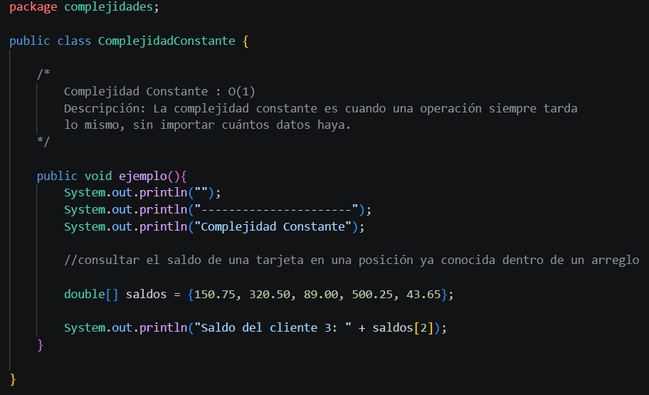

# INVESTIGACION TEORICA

# Teoria de la Complejidad

## ¿Que es la teoria de la complejidad?

La teoría de la complejidad busca medir la dificultad de resolver un problema utilizando algoritmos. Es decir, busca descifrar los recursos necesarios para poder resolver un problema,  especialmente el tiempo y la memoria. La teoría de la complejidad estudia cómo crece la dificultad del problema cuando la cantidad de datos aumenta.

## Eficiencia de algoritmos

Se puede decir que un algoritmo es eficiente cuando puede resolver un problema utilizando la cantidad mínima de recursos posibles. Los cuales se pueden dividir en coste temporal y en coste espacial

El coste temporal es el tiempo que se demora un algoritmo en ejecutarse. El coste temporal no se mide en segundos debido a que este puede variar según el procesador. Por esta razón la medida que se utiliza es el número de operaciones básicas en función de  los datos de entrada. Generalmente se expresa con notación Big O.

El coste espacial se refiere a la cantidad de memoria que un algoritmo necesita requiere durante la ejecución. El coste espacial se divide en espacio de entrada y espacio auxiliar. El espacio de entrada es la memoria necesaria para almacenar los datos que recibe el algoritmo. Dentro del coste espacial se incluyen variables simples, estructura de datos y el uso de memoria en funciones. 

## Factores de tiempo de ejecución

Se refiere a las cosas que hacen que un algoritmo o programa tarde más o menos en ejecutarse.

### Factores Propios

Son los que dependen del algoritmo en sí. Su lógica, la cantidad de operaciones que hace, su estructura, y cómo crece su costo cuando aumenta el tamaño de la entrada. En análisis de algoritmos, esto se estudia con funciones como y con notación asintótica.

### Factores Circunstanciales

Son factores externos al algoritmo, como la computadora usada, el compilador, el lenguaje, el sistema, la implementación concreta o incluso ciertos datos de entrada. Estos factores afectan el tiempo real medido, pero no describen la eficiencia “pura” del algoritmo.

### Analisis Teorico

Consiste en estudiar el algoritmo sin ejecutarlo necesariamente, normalmente usando pseudocódigo y contando operaciones para expresar su tiempo como una función del tamaño de entrada. Sirve para comparar algoritmos de forma más general.

### Analisis Experimental

Consiste en implementar y medir el algoritmo en la práctica, probándolo con distintos tamaños de entrada y observando tiempos reales. Es útil porque da resultados concretos, aunque depende del entorno de prueba.

## Notacion Big O

La notación Big O es una forma de describir el rendimiento de un algoritmo. Sirve para saber cuánto tiempo puede tardar un programa o cuántos recursos puede usar cuando la cantidad de datos aumenta. No se enfoca en segundos exactos, sino en cómo crece el trabajo que hace el algoritmo.

### Mejor caso 

El mejor caso es la situación en la que el algoritmo funciona de la manera más rápida posible. Pasa cuando encuentra la solución casi de inmediato o cuando los datos están en una condición favorable. Este caso muestra el menor tiempo que podría tomar.

### Peor caso 

El peor caso es la situación en la que el algoritmo tarda más. Sucede cuando tiene que revisar muchos datos o hacer más pasos para resolver el problema. Este es uno de los casos más importantes, porque ayuda a conocer el máximo tiempo que podría necesitar el algoritmo.

### Caso promedio 

El caso promedio representa un tiempo intermedio, es decir, lo que normalmente pasaría en una situación común. No es tan rápido como el mejor caso ni tan lento como el peor. Sirve para tener una idea más realista de cómo se comporta un algoritmo en la mayoría de usos.

## Big O, Ω, Θ

Estas tres notaciones se usan para describir el crecimiento de un algoritmo de distintas maneras:

### Big O (O)

Se usa para mostrar el máximo crecimiento que puede tener un algoritmo. Es decir, nos dice cuál sería su comportamiento en el peor escenario o, dicho más simple, lo más que podría tardar cuando aumentan los datos.

### Omega (Ω)

Muestra el mínimo crecimiento que puede tener un algoritmo. O sea, representa el mejor caso o lo menos que podría tardar.

### Theta (Θ)

Se usa cuando el algoritmo tiene un comportamiento más definido, es decir, cuando crece prácticamente al mismo ritmo tanto en el mejor como en el peor caso. Theta muestra una medida más exacta del crecimiento del algoritmo. Si decimos que un algoritmo es Θ(n), significa que su tiempo de ejecución crece de manera proporcional a la cantidad de datos, sin alejarse mucho de ese comportamiento.

# DOCUMENTACION DE LOS EJEMPLOS JAVA

## Complejidad Constante

### Descripcion de ejemplo

La complejidad constante es cuando una operación tarda siempre el mismo tiempo, sin importar el tamaño de los datos.

-El número de pasos es fijo.
-No depende del tamaño de los datos.
-Es de acceso directo.